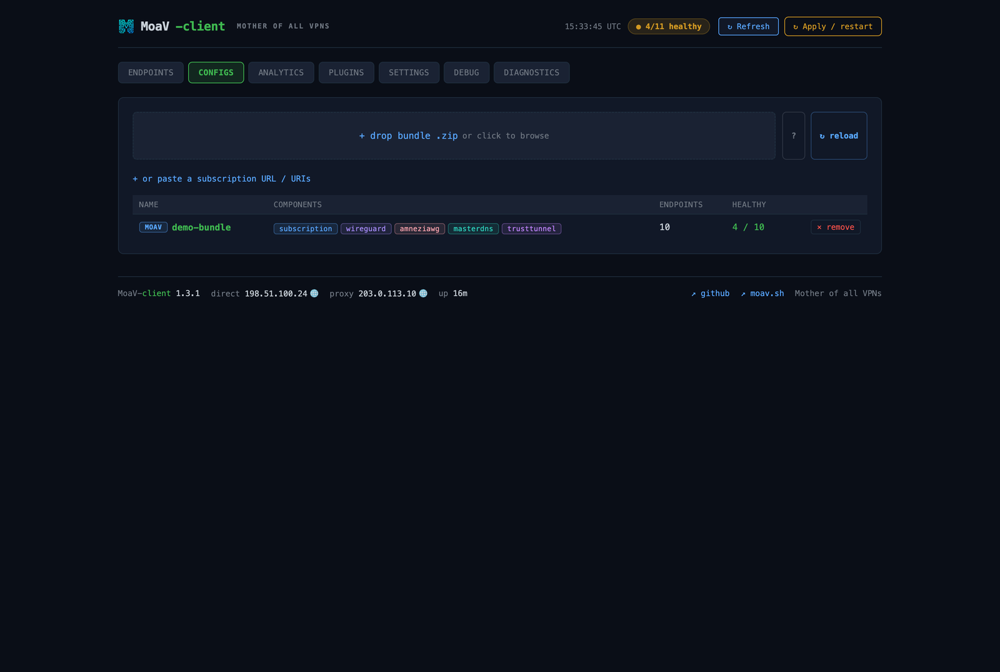
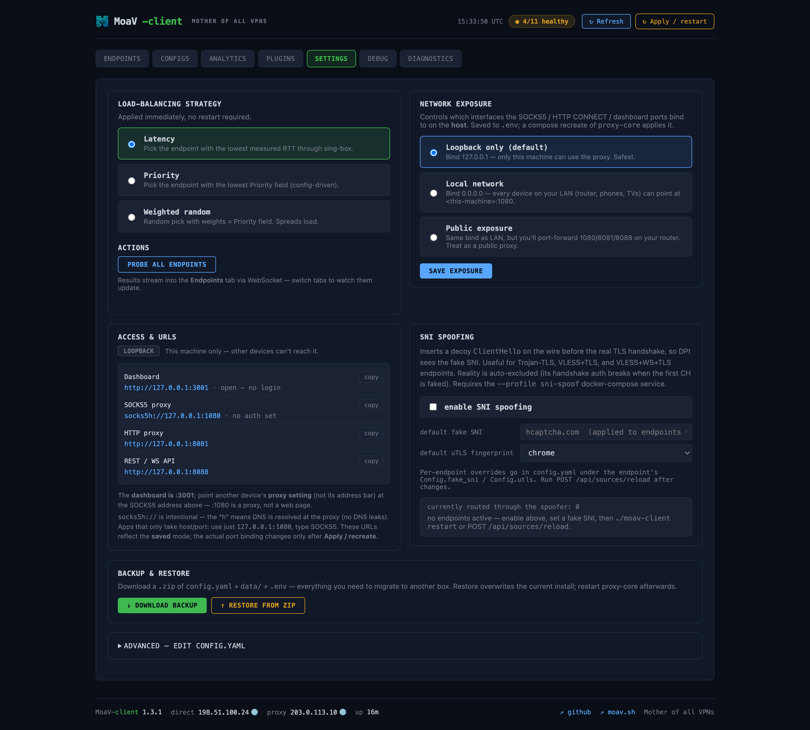

<div dir="rtl">

# moav-client

 

**[English](README.md)** | فارسی

کلاینتی برای سرورهای **[MoaV — مادر همه‌ی VPNها](https://github.com/MotherofallVPNs/moav)**. یک باندل اشتراک چندپروتکلی را می‌خواند، رمزنگاری واقعی هر پروتکل را به sing-box و مجموعه‌ای از sidecarهای اختیاری (MasterDNS، AmneziaWG، Psiphon، TrustTunnel، Tor) واگذار می‌کند، تأخیر هر endpoint را به‌صورت سرتاسری از داخل تونل اندازه می‌گیرد، بار را روی مجموعه‌ی سالم پخش می‌کند، و یک پروکسی محلی واحد SOCKS5 / HTTP CONNECT ارائه می‌دهد. یک داشبورد React با ظاهری هماهنگ با پنل ادمین MoaV دید زنده‌ای از سلامت endpointها، پهنای‌باند هر پروتکل، ویرایش قوانین پلاگین و لاگ زنده می‌دهد.


---

## شروع سریع

```bash
curl -fsSL moav.sh/client-install.sh | bash
```

نصب‌کننده پیش‌نیازهای نصب‌نشده (docker، git، curl، python3) را **خودکار نصب می‌کند**، مخزن را clone می‌کند، اجازه می‌دهد sidecarها را از یک چک‌لیست انتخاب کنید (فقط ایمیج‌های انتخابی build می‌شوند)، `config.yaml` را می‌سازد، ایمیج‌ها را build می‌کند، استک را بالا می‌آورد، در صورت تمایل آن را روی شبکه‌ی محلی باز می‌کند و دستور سراسری `moavc` را نصب می‌کند. هم تعاملی (حتی وقتی با `bash` پایپ شود) و هم کاملاً headless کار می‌کند — به [docs/INSTALL.md](docs/INSTALL.md) نگاه کنید.

سپس استک را با **`moavc`** مدیریت کنید (نام کامل `moav-client` هم کار می‌کند):

```bash
moavc status                # وضعیت سرویس‌ها + سلامت + آدرس‌ها
moavc info                  # فقط آدرس‌های داشبورد / پروکسی / API
moavc logs -f proxy-core    # دنبال‌کردن لاگ‌ها
moavc probe                 # اجرای probe تأخیر
moavc sidecar add tor       # فعال‌سازی + build + اجرای یک sidecar
moavc expose lan            # سطح دسترسی: loopback | lan | public
moavc update [-b <branch>]  # pull (و در صورت نیاز تعویض شاخه) + rebuild
moavc uninstall [--wipe]    # حذف استک (--wipe کانفیگ/داده را هم پاک می‌کند)
```

آدرس‌های ارائه‌شده:

| چیست | آدرس |
|---|---|
| داشبورد | http://localhost:3001 |
| پروکسی SOCKS5 | `socks5h://localhost:1080` |
| پروکسی HTTP CONNECT | http://localhost:8081 |
| REST + WS API | http://localhost:8088 |

مرورگر یا پروکسی سیستم را روی `socks5h://localhost:1080` تنظیم کنید. هر اتصال از سالم‌ترین endpoint عبور می‌کند.

### منابع

اندازه‌ی واقعی ایمیج روی دیسک (amd64). هسته همیشه اجرا می‌شود؛ sidecarها اختیاری‌اند (با `--profile`). هر کانتینر در `docker-compose.yml` محدودیت حافظه و CPU دارد.

| سرویس | دیسک | RAM بی‌کار | سقف | پروفایل |
|---|---|---|---|---|
| proxy-core | ~۱۸ MB | ~۸ MB | 256m / 1.0 | همیشه |
| web-ui | ~۷۶ MB | ~۳ MB | 128m / 0.5 | همیشه |
| sing-box | ~۱۱۶ MB | ~۱۴ MB | 256m / 1.0 | همیشه |
| xray | ~۶۶ MB | ~۱۰ MB | 256m / 0.5 | همیشه (باینری رسمی XTLS، پین‌شده با `XRAY_VERSION`) |
| MasterDNS | ~۱۳۸ MB | — | 128m / 0.5 | `masterdns` |
| AmneziaWG | ~۱۴۹ MB | ~۴ MB | 256m / 0.5 | `amneziawg` |
| Psiphon | ~۱۷۶ MB | ~۶ MB | 256m / 0.5 | `psiphon` |
| TrustTunnel | ~۱۴۷ MB | ~۱۴ MB | 256m / 0.5 | `trusttunnel` |
| Tor | ~۸۶ MB | ~۶۸ MB | 256m / 0.5 | `tor` |

| مصرف | فقط هسته | استک کامل |
|---|---|---|
| دیسک (ایمیج‌های runtime) | ~۲۷۶ MB | ~۹۷۰ MB |
| دانلود نصب اولیه | ~۱۱۵ MB | ~۳۹۰ MB |
| RAM (بی‌کار) | ~۳۵ MB | ~۱۳۰ MB |

مرحله‌ی `[5/5]` نصب‌کننده پیش از build یک جدول تخمینی دانلود/دیسک برای هر مؤلفه نشان می‌دهد. یک build کامل حدود ۸ GB کش build هم می‌گذارد که با `docker builder prune` قابل پاک‌سازی است؛ به‌روزرسانی‌ها فقط لایه‌های تغییریافته را دانلود می‌کنند.

---

## پروتکل‌های پشتیبانی‌شده

پارسر باندل، فرمت استاندارد اشتراک MoaV (URIهای سبک V2Ray با base64) به‌علاوه‌ی فایل‌های اختیاری `.conf` وایرگارد را می‌پذیرد.

| پروتکل | مسیر اتصال | توضیح |
|---|---|---|
| VLESS / Reality | خروجی sing-box | اثرانگشت utls، کلید عمومی و short-id ریالیتی |
| VLESS + WS + TLS (CDN) | خروجی sing-box | utls + ALPN + path / host |
| Trojan + TLS | خروجی sing-box | اثرانگشت uTLS، SNI |
| AnyTLS | خروجی sing-box | TLS + رمز عبور، اثرانگشت uTLS تصادفی، SNI، پرچم `insecure` |
| Shadowsocks-2022 | خروجی sing-box | 2022-blake3-aes-128-gcm |
| Hysteria 2 (+obfs) | خروجی sing-box | مبهم‌سازی salamander |
| VLESS + XHTTP + Reality | خروجی xray | xhttp فقط در Xray است؛ روی ‎11800+‎ |
| WireGuard | بلوک `endpoints[]` در sing-box | از `wireguard.conf` |
| AmneziaWG | sidecar `amneziawg` | `amneziawg-go` فضای‌کاربر + microsocks روی مسیر پیش‌فرض awg0 |
| TrustTunnel | sidecar `trusttunnel` | کلاینت آماده‌ی بالادست (HTTP/2 + HTTP/3) در حالت SOCKS5 |
| MasterDNS | sidecar `masterdns` | باینری بالادست از `masterking32/MasterDnsVPN` |
| Psiphon | sidecar `psiphon` | از سورس `Psiphon-Labs/psiphon-tunnel-core`؛ با کانفیگ توکار بدون نیاز به اعتبارنامه تونل می‌زند |
| Tor | sidecar `tor` | `peterdavehello/tor-socks-proxy` — SOCKS5 روی ‎:9150‎، بدون اعتبارنامه |

هر sidecar ورودی SOCKS5 خودش را روی شبکه‌ی داکری `moav-net` ارائه می‌دهد؛ moav-client هرکدام را یک عضو در استخر متعادل‌کننده می‌بیند.

---

## داشبورد وب

| تب | کاری که می‌توانید انجام دهید |
|---|---|
| **Endpoints** | وضعیت و تأخیر زنده. روشن/خاموش‌کردن هرکدام (toggle برای sidecar کانتینر را هم متوقف/شروع می‌کند). ویرایش اولویت درجا. ردیف‌های غیرفعال نشان `DISABLED` می‌گیرند. |
| **Configs** | وارد کردن باندل سرور دیگر با رهاکردن فایل `.zip` — زیر `data/<name>/` استخراج و یک منبع اضافه می‌شود. فهرست/حذف منابع و reload. |
| **Analytics** | کارت‌های آپلود/دانلود هر پروتکل با نمودار ۲ دقیقه‌ای، نمودار سطحی هم‌پوشان، و جدول هر endpoint با شمارش dial/خطا/failover. |
| **Plugins** | فهرست، مرتب‌سازی، ویرایش و حذف قوانین مسیریابی. افزودن از کاتالوگ آماده. تغییرات بدون restart اعمال می‌شوند. |
| **Settings** | در پنل‌های جداگانه: استراتژی متعادل‌سازی + probe، **سطح دسترسی شبکه** (loopback / lan / public با احراز هویت اختیاری SOCKS5 و داشبورد)، آدرس‌ها و URLها، کلید SNI-spoof، پشتیبان‌گیری/بازیابی، و در پایین یک ویرایشگر **پیشرفته‌ی** `config.yaml` به‌صورت تاشو. |
| **Debug** | لاگ زنده (بافرهای حلقوی per-level، ~۸۰۰ رویداد برای هر سطح). فیلتر، pause/autoscroll/copy/clear. به‌علاوه جدول flow هر اتصال. |
| **Diagnostics** | بررسی اتصال از خود proxy-core: TCP، DNS یا traceroute — اختیاراً *از داخل* تونل یک endpoint مشخص. |


<table>
  <tr>
    <td width="50%"><br><sub><b>Analytics</b> — پهنای باند زنده‌ی هر پروتکل</sub></td>
    <td width="50%"><br><sub><b>Plugins</b> — قواعد مسیریابی (اولین تطابق برنده)</sub></td>
  </tr>
  <tr>
    <td width="50%"><br><sub><b>Configs</b> — منابع باندل چندسروره</sub></td>
    <td width="50%"><br><sub><b>Settings</b> — استراتژی، سطح دسترسی، آدرس‌ها</sub></td>
  </tr>
</table>

---

## پیکربندی

فایل `config.yaml` همه‌چیز را کنترل می‌کند؛ sing-box و xray به‌صورت پیش‌فرض روشن‌اند (رمزنگاری پروتکل‌ها). فایل کامل و کامنت‌گذاری‌شده‌ی [`config.yaml.example`](config.yaml.example) مرجع است — کپی و ویرایش کنید. بخش‌های کلیدی:

- `proxy` — پورت‌های listener + احراز هویت اختیاری SOCKS5
- `subscription` — `file` / `url` / `wireguard_files` یا چند `sources`
- `load_balancing.strategy` — `latency` | `priority` | `weighted`
- `plugins` — `torrent_block`، `block_direct`، `routing_rules`
- `singbox` / `xray` / `sni_spoof` — sidecarهای dialer (پیش‌فرض روشن)
- `sidecars` — `masterdns` / `amneziawg` / `psiphon` / `trusttunnel` / `tor`

اکثر کاربران هرگز `config.yaml` را دستی ویرایش نمی‌کنند — وارد کردن باندل (تب Configs) و toggle کردن در داشبورد آن را برایتان می‌نویسد، یا از ویرایشگر **پیشرفته‌ی** تاشو در پایین تب Settings استفاده کنید.

**نسخه‌ها** در `.env` پین می‌شوند: `XRAY_VERSION` (تگ نسخه‌ی رسمی XTLS)، `IMAGE_SINGBOX` / `IMAGE_TOR` / `IMAGE_CADDY` (رفرنس ایمیج‌های pull‌شده) و `MOAV_VERSION`. نسخه‌ی کلاینت در فایل `VERSION` است. به [`.env.example`](.env.example) نگاه کنید.

---

## پلاگین‌ها

زنجیره‌ی قوانین «اولین تطابق برنده». هم `config.yaml` و هم تب Plugins داشبورد یک موتور را تغذیه می‌کنند؛ تغییرات داشبورد بدون restart اعمال می‌شوند.

انواع تطابق: `domain`، `domain_suffix`، `domain_keyword`، `ip_cidr`، `geoip`، `port`، `protocol`.
عمل‌ها: `proxy` (پیش‌فرض)، `direct` (دور زدن)، `block` (انداختن).

### مسدودسازی مستقیم (کلید قطع)

`plugins.block_direct: true` یک کلید قطع نشت است: هر اتصالی که قرار است مستقیم برود انداخته می‌شود — هم یک قانون `direct` و هم fallback آخرین‌چاره‌ی متعادل‌کننده وقتی همه‌ی endpointها down هستند. پیش‌فرض `false`. وقتی روشن است قوانین `direct` مثل `lan-direct` را هم می‌شکند.

### GeoIP

قوانین `geoip:<cc>` یک IP مقصد را با لیست CIDR در `geoip/<cc>.txt` تطبیق می‌دهند (لیست ایران در مخزن هست و هفتگی توسط CI به‌روز می‌شود). تطابق فقط روی **IP** است — میزبان‌های نام‌دار resolve نمی‌شوند. به [geoip/README.md](geoip/README.md) نگاه کنید.

---

## CLI

دو ابزار خط‌فرمان هم‌نام‌اند. **رپر مدیریتی** — در `PATH` با نام **`moavc`** (و `moav-client`) نصب می‌شود — استک داکر را روزمره مدیریت می‌کند:

```
moavc <command>

  up | down | restart        شروع / توقف / rebuild استک
  status                     وضعیت سرویس‌ها + سلامت + آدرس‌ها
  info                       فقط آدرس‌های داشبورد / پروکسی / API
  logs [-f] [service]        دنبال‌کردن لاگ‌ها
  probe | stats              probe endpointها / نمایش شمارنده‌ها
  sidecar add|remove|list    مدیریت sidecarهای اختیاری
  install                    اجرای دوباره‌ی ویزارد نصب
  expose <loopback|lan|public>   تغییر سطح دسترسی شبکه
  update [-b <branch>]       pull (و در صورت نیاز تعویض شاخه) + rebuild
  uninstall [--wipe]         حذف استک (--wipe کانفیگ/داده را پاک می‌کند)
  open | version
```

**باینری proxy-core** (داخل کانتینر، `FROM scratch`) خودِ پروکسی را اجرا می‌کند و زیرفرمان‌های خودش را دارد — `serve` (پیش‌فرض)، `probe`، `list`، `fetch-sub <url>`، `healthcheck`، `version` — همگی با `--config <path>`.

---

## مستندات

- [docs/INSTALL.md](docs/INSTALL.md) — نصب headless / با فلگ، سطح دسترسی شبکه، به‌روزرسانی و حذف
- [docs/PLUGINS.md](docs/PLUGINS.md) — قوانین مسیریابی، کلید قطع، geoip و کاتالوگ کامل قالب‌ها
- [docs/SIDECARS.md](docs/SIDECARS.md) — TrustTunnel، Psiphon، Tor، MasterDNS، AmneziaWG
- [docs/SNI_SPOOFING.md](docs/SNI_SPOOFING.md) — sidecar اختیاری SNI-spoofing
- [docs/ARCHITECTURE.md](docs/ARCHITECTURE.md) — پل sing-box، متعادل‌کننده/failover، prober، کنترل داکر
- [docs/TROUBLESHOOTING.md](docs/TROUBLESHOOTING.md) — مشکلات رایج
- [docs/MOAV_BUNDLE.md](docs/MOAV_BUNDLE.md) — پیشنهاد فرمت باندل `moav://`
- [CLAUDE.md](CLAUDE.md) — راهنمای عامل LLM

---

## مجوز

MIT — رجوع به [LICENSE](LICENSE).

</div>
