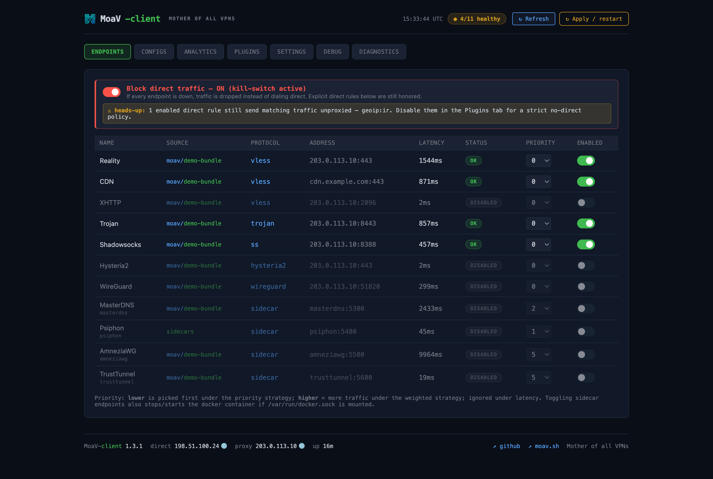
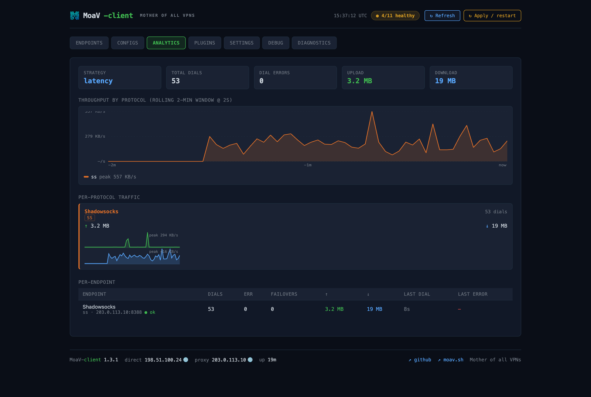
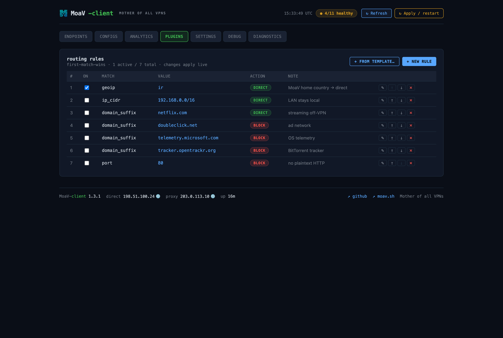

# moav-client

 

English | **[فارسی](README-fa.md)**

A client for **[MoaV — Mother of all VPNs](https://github.com/shayanb/MoaV)** servers. It ingests a multi-protocol subscription bundle, delegates real protocol cryptography to sing-box plus a stack of optional sidecars (MasterDNS, AmneziaWG, Psiphon, TrustTunnel, Tor), latency-probes every endpoint end-to-end through its tunnel, load-balances across the healthy set, and exposes a single local SOCKS5 / HTTP CONNECT proxy. A React dashboard styled to match the MoaV admin panel gives live visibility into endpoint health, per-protocol throughput, plugin rule editing, and a streaming debug log.

<!-- screenshot: dashboard overview (Endpoints tab) -->
<!--  -->

---

## Quick start

```bash
curl -fsSL https://raw.githubusercontent.com/MotherofallVPNs/moav-client/main/install.sh | bash
```

The installer checks prerequisites, clones the repo, lets you pick sidecars,
seeds `config.yaml`, builds the images, brings the stack up, and installs a
global `moav-client` command. Works interactively or headless — see
[docs/INSTALL.md](docs/INSTALL.md) for headless/flag-driven installs.

Then manage the stack with `moav-client`:

```bash
moav-client status                # docker compose ps
moav-client logs proxy-core       # tail logs
moav-client probe                 # trigger probe via API
moav-client sidecar add tor       # enable + build + start the tor sidecar
moav-client update                # git pull + rebuild + restart
```

Endpoints exposed:

| What | Address |
|---|---|
| Dashboard | http://localhost:3001 |
| SOCKS5 proxy | `socks5h://localhost:1080` |
| HTTP CONNECT | http://localhost:8081 |
| REST + WS API | http://localhost:8088 |

Point your browser or system proxy at `socks5h://localhost:1080`. Every connection routes through the healthiest moav server endpoint.

### Resources

Per-container disk + first-install download (amd64). Core services always run;
sidecars are opt-in via `--profile`.

| Service | Disk | Download | Profile |
|---|---|---|---|
| proxy-core | ~18 MB | core | always |
| web-ui | ~75 MB | core | always |
| sing-box | ~116 MB | core | always |
| xray | ~104 MB | core | always |
| MasterDNS | ~138 MB | sidecar | `masterdns` |
| AmneziaWG | ~149 MB | sidecar | `amneziawg` |
| Psiphon | ~176 MB | sidecar | `psiphon` |
| TrustTunnel | ~90 MB | sidecar | `trusttunnel` |
| Tor | ~85 MB | sidecar | `tor` |

| Footprint | Core only | Full stack |
|---|---|---|
| Disk (runtime images) | ~313 MB | ~945 MB |
| First-install download | ~190 MB | ~810 MB |
| RAM (idle) | ~150 MB | ~400 MB |

A full build also leaves ~4 GB of build cache, reclaimable with
`docker builder prune`. Updates re-download only changed layers.

---

## Supported protocols

The bundle parser accepts the standard MoaV subscription format (base64-encoded V2Ray-style URIs) plus optional WireGuard `.conf` files alongside.

| Protocol | Dial path | Notes |
|---|---|---|
| VLESS / Reality | sing-box outbound | utls fingerprint, Reality pbk + sid |
| VLESS + WS + TLS (CDN) | sing-box outbound | utls + ALPN + path / host |
| Trojan + TLS | sing-box outbound | uTLS fingerprint, SNI |
| Shadowsocks-2022 | sing-box outbound | 2022-blake3-aes-128-gcm |
| Hysteria 2 (+obfs) | sing-box outbound | salamander obfs |
| VLESS + XHTTP + Reality | xray outbound | xhttp is Xray-only; the xray sidecar handles it on 11800+ |
| WireGuard | sing-box `endpoints[]` | parsed from `wireguard.conf` |
| AmneziaWG | `amneziawg` sidecar | userspace `amneziawg-go` + `awg setconf` + microsocks on awg0 default route |
| TrustTunnel | `trusttunnel` sidecar | upstream prebuilt client (HTTP/2 + HTTP/3), run in SOCKS5 mode |
| MasterDNS | `masterdns` sidecar | upstream binary from `masterking32/MasterDnsVPN` releases |
| Psiphon | `psiphon` sidecar | builds `Psiphon-Labs/psiphon-tunnel-core` from source; tunnels out of the box with its embedded config |
| Tor | `tor` sidecar | `peterdavehello/tor-socks-proxy` — SOCKS5 on :9150, no credentials |

Every sidecar exposes its own SOCKS5 inbound on the `moav-net` Docker network; moav-client treats each as one entry in the balancer pool.

---

## Web dashboard

| Tab | What you can do |
|---|---|
| **Endpoints** | Live status & latency. Toggle each on/off (sidecar toggles also stop/start the docker container). Edit priority inline. Disabled rows show a `DISABLED` pill instead of a stale status. |
| **Sources** | Import another MoaV server's bundle by dropping its `.zip` — extracts under `data/<name>/` and appends a `subscription.sources` entry. List / remove configured sources; trigger a reload. |
| **Analytics** | Per-protocol upload/download cards with rolling 2-min sparklines, an overlay-area throughput chart of all protocols, per-endpoint table with dial / error / failover counts and last-error reason. |
| **Plugins** | List, reorder, edit, enable/disable, delete routing rules. Add from a curated template catalog — networking/privacy (LAN-direct, trackers, ad domains, telemetry, port-80 block) plus "selective app" sets (system updates, Zoom, iCloud, cloud sync, streaming, game downloads). All disabled by default; changes hot-apply and persist to `config.yaml`. See [docs/PLUGINS.md](docs/PLUGINS.md). |
| **Settings** | Switch load-balancing strategy live (latency / priority / weighted random), "Probe all endpoints now", **Network exposure** (loopback / LAN / public with optional SOCKS5 auth, written to `.env`), SNI-spoof toggle, and config backup / restore. |
| **Debug** | Streaming log tail (server-side per-level ring buffers, ~800 events each for info / warn / error so warnings aren't crowded out by info spam). Level chips with counts, substring filter, pause / autoscroll / copy / clear. Plus a per-connection flow table. |
| **Diagnostics** | Run a connectivity check from proxy-core itself: TCP connect, DNS lookup, or TCP-TTL traceroute — optionally *through* a chosen endpoint's tunnel, to tell "my router can't reach this host" from "this endpoint's tunnel is down". |
| **Config** | Live-loads `config.yaml` from disk. Edit + save (writes back atomically). "Restart proxy-core to apply" notice for structural changes. |

A `↻ Refresh` button in the topbar reloads every tab in place; the health pill next to it shows `healthy/total`.

<!-- screenshot/gif: dashboard tabs walkthrough -->
<!--  -->
<!-- screenshot: Analytics tab (per-protocol throughput) -->
<!--  -->
<!-- screenshot: Plugins tab (routing rules) -->
<!--  -->

---

## Config

`config.yaml` controls everything; sing-box and xray are enabled by default
(they do the protocol crypto). The fully-commented
[`config.yaml.example`](config.yaml.example) is the reference — copy it and
edit. Key sections:

- `proxy` — listener ports + optional SOCKS5 auth
- `subscription` — `file` / `url` / `wireguard_files`, or multiple `sources`
- `load_balancing.strategy` — `latency` | `priority` | `weighted`
- `plugins` — `torrent_block`, `block_direct`, `routing_rules`
- `singbox` / `xray` / `sni_spoof` — dialer sidecars (enabled by default)
- `sidecars` — `masterdns` / `amneziawg` / `psiphon` / `trusttunnel` / `tor`

Most users never edit `config.yaml` by hand — importing a bundle (Sources tab)
and toggling endpoints/sidecars in the dashboard writes it for you.

---

## Plugins

First-match-wins rule chain. Both `config.yaml` and the dashboard Plugins tab feed the same engine; changes from the dashboard hot-apply.

Match types: `domain`, `domain_suffix`, `domain_keyword`, `ip_cidr`, `geoip`, `port`, `protocol`.
Actions: `proxy` (default — go through the balancer), `direct` (bypass), `block` (drop).

### Block direct (kill-switch)

`plugins.block_direct: true` (also a toggle above the Endpoints table) drops
the balancer's **involuntary** direct fallback — the dial it would otherwise
make when *every* endpoint is down — so a downed proxy pool can't leak the real
IP. Default `false`.

**Explicit `direct` rules always win** and are honored even with the kill-switch
on — so `geoip:ir → direct` keeps sending Iranian destinations direct, and a
`lan-direct` rule keeps LAN access working. When the kill-switch is on and any
`direct` rules are enabled, the dashboard toggle names them, since that traffic
still bypasses the proxy. For a strict no-direct policy, turn the kill-switch on
*and* disable your `direct` rules.

Curated templates ship with the binary and surface in the dashboard's `+ from template…` picker — all rules land disabled so you can review before enabling. Networking/privacy: `lan-direct`, `block-known-trackers`, `block-ad-networks`, `block-telemetry`, `force-tls-only`, `direct-anthropic`. "Selective app" (route by destination, not process): `block-system-updates`, `direct-zoom`, `direct-icloud`, `direct-cloud-sync`, `direct-streaming`, `direct-game-downloads`.

See **[docs/PLUGINS.md](docs/PLUGINS.md)** for the full catalog, every rule, the block-vs-direct rationale, and the "this isn't true per-app tunneling" caveat.

### GeoIP

`geoip:<cc>` rules match a destination IP against `geoip/<cc>.txt` CIDR lists
(Iran ships in-repo, refreshed weekly by CI). Matching is **IP-only** —
hostname destinations aren't resolved, so geoip rules apply to IP-literal
targets. See [geoip/README.md](geoip/README.md) for sources and how to add
countries.

---

## CLI

`moav-client` ships as a single binary. Subcommands:

```
moav-client [command] [flags]

Commands:
  serve       Start the proxy + API (default if no command given)
  probe       One-shot latency probe of all endpoints
  list        List endpoints without probing
  fetch-sub   Fetch and parse a subscription URL
  healthcheck Probe the local API and exit 0/1 (container healthcheck; works on the scratch image)
  version     Print version
  help        Print usage

Global flags:
  --config    Path to config.yaml  (default: config.yaml)
```

---

## REST API

The API server listens on `proxy.api_port` (default 8088). Responses are JSON; all routes accept permissive CORS for the dashboard.

| Method | Path | Description |
|---|---|---|
| GET | `/api/healthz` | liveness — `{"ok":true}` |
| GET | `/api/version` | build version + commit, uptime, install/proxy egress IP + country (footer) |
| GET | `/api/endpoints` | current pool with status / latency / config |
| PATCH | `/api/endpoints/<id>` | `{enabled, priority}` — patches the endpoint, also stops/starts the docker container for sidecars (if the docker socket is mounted) |
| POST | `/api/probe` | trigger an immediate probe pass |
| GET | `/api/stats` | per-endpoint counters (dials, errors, failovers, bytes_up/down, last_error) + active strategy |
| POST | `/api/strategy` | switch load-balancing strategy at runtime |
| GET | `/api/flows` | recent per-connection flow records (dest, endpoint, bytes, result) |
| GET/PUT | `/api/plugins` | get `{rules, templates}` / atomic rule-list replace |
| GET | `/api/logs` | log ring buffer; optional `?level=` filter |
| GET/POST | `/api/config` | get / atomic write-back of on-disk `config.yaml` |
| POST | `/api/bundles` | multipart `.zip` upload → extract under `data/<name>/` + register a source |
| GET | `/api/sources` | list configured subscription sources |
| DELETE | `/api/sources/<name>` | remove a source from `config.yaml` |
| POST | `/api/sources/reload` | self-restart proxy-core to reload subscription state |
| GET/PUT | `/api/exposure` | bind policy (loopback / lan / public) + SOCKS5 auth → `.env` |
| GET/PUT | `/api/snispoof` | SNI-spoof enable + default fake SNI / uTLS |
| GET | `/api/diag` | `?type=tcp\|dns\|trace&target=…&via=<endpoint>` connectivity check |
| GET | `/api/backup` | download a tar.gz of config + sources |
| POST | `/api/restore` | restore from an uploaded backup tar.gz |
| WS | `/api/ws` | multiplexes `endpoints` and `log` frames |

---

## Docs

- [docs/INSTALL.md](docs/INSTALL.md) — headless / flag-driven install, network exposure
- [docs/PLUGINS.md](docs/PLUGINS.md) — routing rules, the kill-switch, geoip, and the full template catalog
- [docs/SIDECARS.md](docs/SIDECARS.md) — TrustTunnel, Psiphon, Tor, MasterDNS, AmneziaWG
- [docs/SNI_SPOOFING.md](docs/SNI_SPOOFING.md) — optional decoy-ClientHello sidecar
- [docs/ARCHITECTURE.md](docs/ARCHITECTURE.md) — sing-box bridge, balancer/failover, prober, docker control
- [docs/TROUBLESHOOTING.md](docs/TROUBLESHOOTING.md) — common issues
- [docs/MOAV_BUNDLE.md](docs/MOAV_BUNDLE.md) — `moav://` bundle format proposal ([#1](https://github.com/MotherofallVPNs/moav-client/issues/1))
- [CLAUDE.md](CLAUDE.md) — LLM agent guide

---

## Development

### Run proxy-core locally (no docker)

```bash
cd proxy-core
go run . --config ../config.yaml
```

### Run web-ui locally

```bash
cd web-ui
npm install
npm run dev
# Vite dev server at http://localhost:5173
# Default API target: http://localhost:8088 (override with VITE_API_URL)
```

### Tests

```bash
cd proxy-core && go test ./...
cd web-ui && npm run build  # type-check + bundle
```

---

## License

MIT — see [LICENSE](LICENSE).
