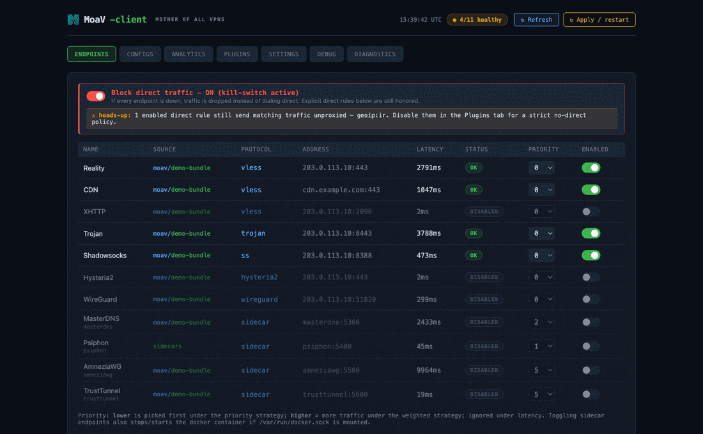
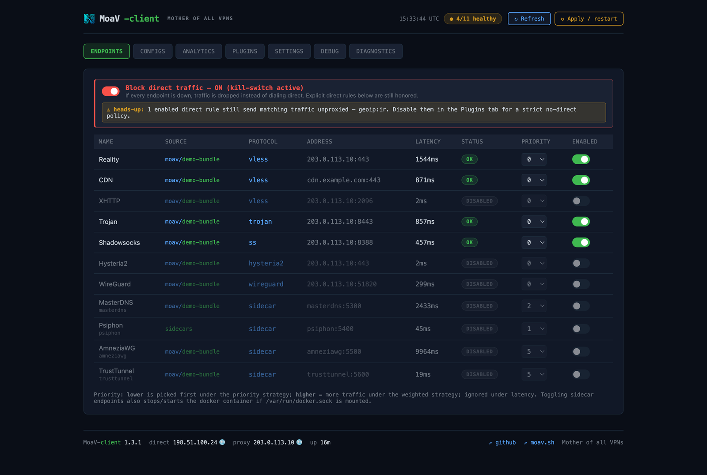
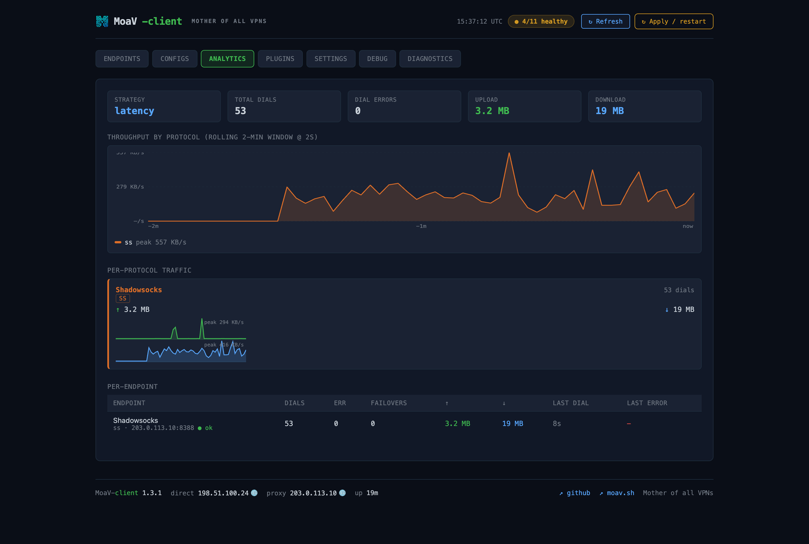
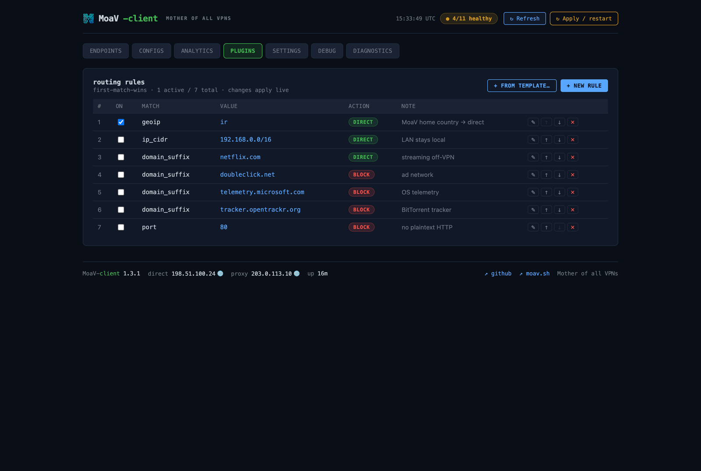
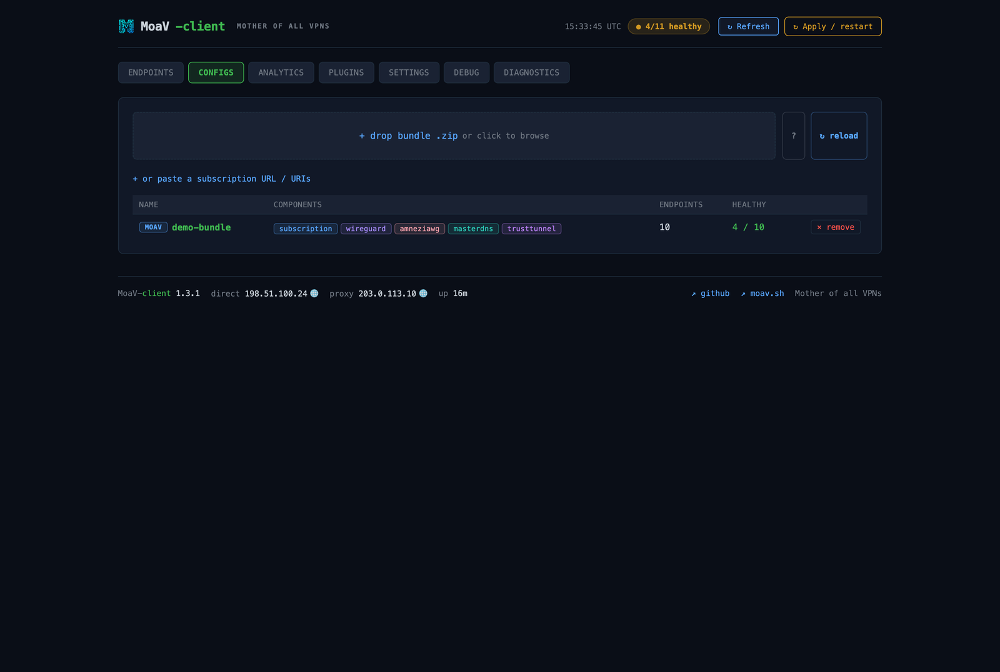
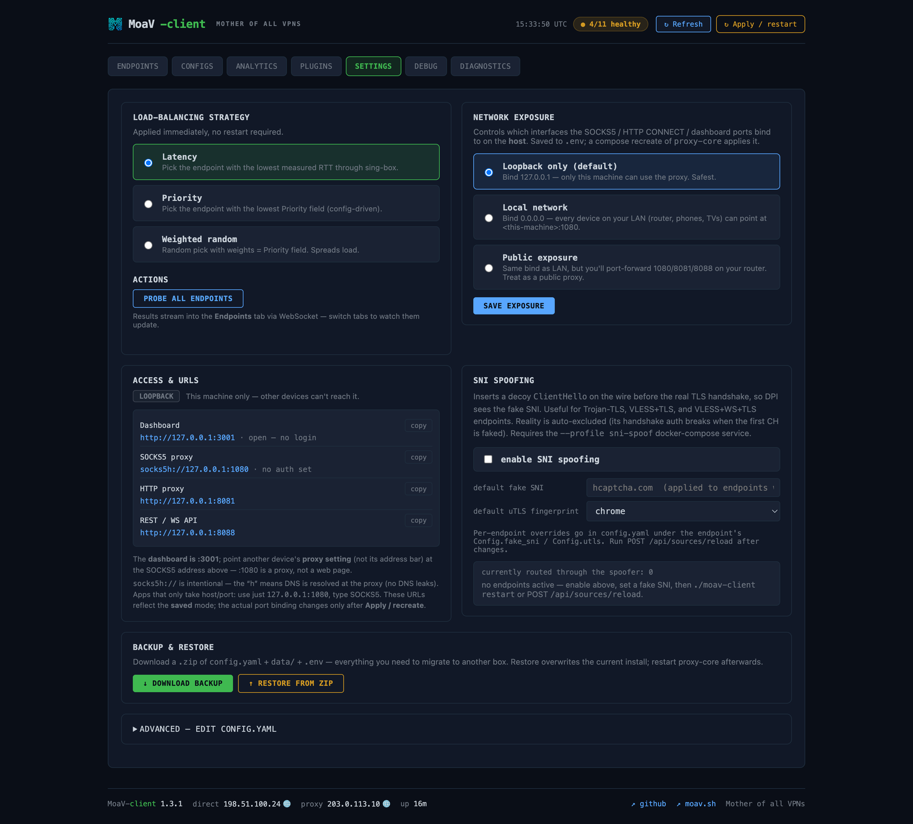

<div align="center">

# moav-client

**One local proxy in front of every protocol your MoaV server speaks.**

[](https://go.dev) [](LICENSE) [](https://github.com/MotherofallVPNs/moav-client/releases/latest)

[](https://github.com/MotherofallVPNs/MoaV) [](#supported-protocols) [](https://t.me/motherofallvpns) [](https://x.com/motherofallvpns)

🇬🇧 [English](README.md) &nbsp;·&nbsp; 🇮🇷 [فارسی](README-fa.md)

Built and maintained by the **[MoaV](https://github.com/MotherofallVPNs)** community.

</div>

---

## Why moav-client

A MoaV server hands you many protocols on purpose: no single transport survives every
censor, so when one path is fingerprinted you switch to another. But a phone or laptop
usually speaks *one* protocol at a time, and picking the live one by hand, in the middle
of an outage, is exactly the wrong moment to be editing config.

moav-client takes the whole bundle and does that for you. It delegates the real protocol
cryptography to sing-box plus a stack of optional sidecars (MasterDNS, AmneziaWG, Psiphon,
TrustTunnel, Tor), latency-probes every endpoint end-to-end through its own tunnel, load-
balances across the healthy set, and exposes a single local SOCKS5 / HTTP CONNECT proxy.
Point your browser or system at that one address; it routes through whichever server
endpoint is fastest and alive right now. A React dashboard styled to match the MoaV admin
panel gives live visibility into endpoint health, per-protocol throughput, routing-rule
editing, and a streaming debug log.

---

## Table of Contents

**Links** &nbsp;·&nbsp; [MoaV server](https://github.com/MotherofallVPNs/MoaV) &nbsp;·&nbsp; [Docs](docs/) &nbsp;·&nbsp; [Telegram](https://t.me/motherofallvpns)

**Get started** &nbsp;·&nbsp; [Why moav-client](#why-moav-client) &nbsp;·&nbsp; [See it in action](#see-it-in-action) &nbsp;·&nbsp; [Quick start](#quick-start) &nbsp;·&nbsp; [Import your config](#import-your-config)

**Use it** &nbsp;·&nbsp; [Supported protocols](#supported-protocols) &nbsp;·&nbsp; [Web dashboard](#web-dashboard) &nbsp;·&nbsp; [Config](#config) &nbsp;·&nbsp; [Plugins](#plugins) &nbsp;·&nbsp; [CLI](#cli)

**Under the hood** &nbsp;·&nbsp; [REST API](#rest-api) &nbsp;·&nbsp; [Docs](#docs) &nbsp;·&nbsp; [Development](#development) &nbsp;·&nbsp; [Community](#community)

---

## See it in action

<div align="center">
<a href="https://github.com/MotherofallVPNs/moav-client"></a>
<br><sub><b>The dashboard</b> · live endpoint health, per-protocol throughput, and one-click routing</sub>
</div>

---

## Quick start

```bash
curl -fsSL moav.sh/client-install.sh | bash
```

The installer **auto-installs missing prerequisites** (docker, git, curl,
python3), clones the repo, lets you pick sidecars from a checklist (only the
chosen images are built), seeds `config.yaml`, builds the images, brings the
stack up, optionally opens it to your LAN, and installs a global `moavc`
command. Works interactively — even piped through `bash` — or fully headless;
see [docs/INSTALL.md](docs/INSTALL.md).

Then manage the stack with **`moavc`** (the full name `moav-client` also works):

```bash
moavc status                # formatted service status + health + URLs
moavc info                  # just the dashboard / proxy / API URLs
moavc logs -f proxy-core    # tail logs
moavc probe                 # trigger a latency probe
moavc sidecar add tor       # enable + build + start a sidecar
moavc expose lan            # network reach: loopback | lan | public
moavc update [-b <branch>]  # pull (optionally switch branch) + rebuild
moavc uninstall [--wipe]    # remove the stack (--wipe deletes config/data)
```

Endpoints exposed:

| What | Address |
|---|---|
| Dashboard | http://localhost:3001 |
| SOCKS5 proxy | `socks5h://localhost:1080` |
| HTTP CONNECT | http://localhost:8081 |
| REST + WS API | http://localhost:8088 |

Point your browser or system proxy at `socks5h://localhost:1080`. Every connection routes through the healthiest moav server endpoint.

### Resources

Measured on-disk image size (amd64). Core always runs; sidecars are opt-in via
`--profile`. Each container is memory- and CPU-capped in `docker-compose.yml`.

| Service | Disk | Idle RAM | Caps | Profile |
|---|---|---|---|---|
| proxy-core | ~18 MB | ~8 MB | 256m / 1.0 | always |
| web-ui | ~76 MB | ~3 MB | 128m / 0.5 | always |
| sing-box | ~116 MB | ~14 MB | 256m / 1.0 | always |
| xray | ~66 MB | ~10 MB | 256m / 0.5 | always (official XTLS binary, pinned `XRAY_VERSION`) |
| MasterDNS | ~138 MB | — | 128m / 0.5 | `masterdns` |
| AmneziaWG | ~149 MB | ~4 MB | 256m / 0.5 | `amneziawg` |
| Psiphon | ~176 MB | ~6 MB | 256m / 0.5 | `psiphon` |
| TrustTunnel | ~147 MB | ~14 MB | 256m / 0.5 | `trusttunnel` |
| Tor | ~86 MB | ~68 MB | 256m / 0.5 | `tor` |

| Footprint | Core only | Full stack |
|---|---|---|
| Disk (runtime images) | ~276 MB | ~970 MB |
| First-install download | ~115 MB | ~390 MB |
| RAM (idle) | ~35 MB | ~130 MB |

The installer's `[5/5]` step prints a per-component download/disk estimate
before building. A full build also leaves ~8 GB of build cache, reclaimable
with `docker builder prune`. Updates re-download only changed layers.

---

## Import your config

Everything moav-client routes starts from a MoaV bundle. There are three ways to load one; all of them end up in `config.yaml` and can be managed from the dashboard afterwards.

### 1. `moav://` bundle URL (recommended)

MoaV's compact bundle format packs every protocol for one server into a single line. It carries a `<defaultHost>` and the shared credentials once, then one `p=` record per protocol, so a six-protocol server that was ~2 KB as separate URIs becomes ~640 bytes base64'd:

```
moav://<name>@<host>?uuid=…&pw=…&pbk=…&sni_default=…&fp=chrome\
  &p=reality,443,sni=…,flow=xtls-rprx-vision\
  &p=vless-ws,443,host=…,path=…\
  &p=trojan,8443,sni=…\
  &p=hy2,443,obfs=salamander,obfs_pw=…#MoaV
```

(one line on the wire; wrapped here for readability). moav-client expands it into one endpoint per `p=` record, so the balancer, prober, and dashboard treat them exactly like individually-pasted URIs. Drop the `moav://` line into `subscription.url` (or a file at `subscription.file`), or paste it during install. Full grammar and per-protocol keys: **[docs/MOAV_BUNDLE.md](docs/MOAV_BUNDLE.md)**.

### 2. Base64 / plain subscription

The classic V2Ray subscription still works. Point `subscription.url` at an `https://…` link or `subscription.file` at a local `subscription.txt`; the content may be base64-encoded or plain, and may mix `moav://` bundles with legacy single-protocol URIs (`vless://`, `trojan://`, `hysteria2://`, …) one per line. Each line is parsed independently and deduped by URI, so a bundle and the loose URIs for the same server coexist cleanly. WireGuard / AmneziaWG `.conf` files listed in `subscription.wireguard_files` each become one endpoint.

### 3. Drop a server `.zip` (multiple servers)

To run several MoaV servers side by side, use the dashboard's **Configs** tab (or `POST /api/bundles`): drop a server's exported `.zip` and it extracts under `data/<name>/` and appends a `subscription.sources` entry. List, remove, and reload sources from the same tab, no hand-editing.

> Most people never touch `config.yaml` directly. Importing a bundle and toggling endpoints in the dashboard writes it for you.

---

## Supported protocols

The parser accepts MoaV's [`moav://` bundle format](#import-your-config) and the standard subscription format (base64-encoded V2Ray-style URIs), plus optional WireGuard `.conf` files alongside.

| Protocol | Dial path | Notes |
|---|---|---|
| VLESS / Reality | sing-box outbound | utls fingerprint, Reality pbk + sid |
| VLESS + WS + TLS (CDN) | sing-box outbound | utls + ALPN + path / host |
| Trojan + TLS | sing-box outbound | uTLS fingerprint, SNI |
| AnyTLS | sing-box outbound | TLS + password, uTLS random fingerprint, SNI, `insecure` flag |
| Shadowsocks-2022 | sing-box outbound | 2022-blake3-aes-128-gcm |
| Hysteria 2 (+obfs) | sing-box outbound | salamander obfs |
| VLESS + XHTTP + Reality | xray outbound | xhttp is Xray-only; the xray sidecar handles it on 11800+ |
| WireGuard | sing-box `endpoints[]` | parsed from `wireguard.conf` |
| AmneziaWG | `amneziawg` sidecar | userspace `amneziawg-go` + `awg setconf` + microsocks on awg0 default route |
| TrustTunnel | `trusttunnel` sidecar | upstream prebuilt client (HTTP/2 + HTTP/3), run in SOCKS5 mode |
| MasterDNS | `masterdns` sidecar | upstream binary from `masterking32/MasterDnsVPN` releases |
| Psiphon | `psiphon` sidecar | builds `Psiphon-Labs/psiphon-tunnel-core` from source; tunnels out of the box with its embedded config |
| Tor | `tor` sidecar | `peterdavehello/tor-socks-proxy` — SOCKS5 on :9150, no credentials |

Every sidecar exposes its own SOCKS5 inbound on the `moav-net` Docker network; moav-client treats each as one entry in the balancer pool.

> **AnyTLS client support is narrower than VLESS/Trojan.** It is dialed here via sing-box, and is also supported by Hiddify, sing-box (SFA/SFI), NekoBox, mihomo, and Shadowrocket 2.2.65+. Older or other clients may not speak it.

---

## Web dashboard

| Tab | What you can do |
|---|---|
| **Endpoints** | Live status & latency. Toggle each on/off (sidecar toggles also stop/start the docker container; enabling one whose image was never built tells you to run `moavc sidecar add <name>`). Edit priority inline. Disabled rows show a `DISABLED` pill instead of a stale status. |
| **Configs** | Import another MoaV server's bundle by dropping its `.zip` — extracts under `data/<name>/` and appends a `subscription.sources` entry. List / remove configured sources; trigger a reload. |
| **Analytics** | Per-protocol upload/download cards with rolling 2-min sparklines, an overlay-area throughput chart of all protocols, per-endpoint table with dial / error / failover counts and last-error reason. |
| **Plugins** | List, reorder, edit, enable/disable, delete routing rules. Add from a curated template catalog — networking/privacy (LAN-direct, trackers, ad domains, telemetry, port-80 block) plus "selective app" sets (system updates, Zoom, iCloud, cloud sync, streaming, game downloads). All disabled by default; changes hot-apply and persist to `config.yaml`. See [docs/PLUGINS.md](docs/PLUGINS.md). |
| **Settings** | Grouped into panels: load-balancing strategy (latency / priority / weighted) + "Probe all endpoints now", **Network exposure** (loopback / LAN / public with optional SOCKS5 + dashboard auth, written to `.env`), Access & URLs, SNI-spoof toggle, config backup / restore, and a collapsible **advanced** raw `config.yaml` editor at the bottom (edit + atomic save). |
| **Debug** | Streaming log tail (server-side per-level ring buffers, ~800 events each for info / warn / error so warnings aren't crowded out by info spam). Level chips with counts, substring filter, pause / autoscroll / copy / clear. Plus a per-connection flow table. |
| **Diagnostics** | Run a connectivity check from proxy-core itself: TCP connect, DNS lookup, or TCP-TTL traceroute — optionally *through* a chosen endpoint's tunnel, to tell "my router can't reach this host" from "this endpoint's tunnel is down". |

A `↻ Refresh` button in the topbar reloads every tab in place; the health pill next to it shows `healthy/total`.



<table>
  <tr>
    <td width="50%"><br><sub><b>Analytics</b> — live per-protocol throughput</sub></td>
    <td width="50%"><br><sub><b>Plugins</b> — first-match-wins routing rules</sub></td>
  </tr>
  <tr>
    <td width="50%"><br><sub><b>Configs</b> — multi-server bundle sources</sub></td>
    <td width="50%"><br><sub><b>Settings</b> — strategy, exposure, access URLs</sub></td>
  </tr>
</table>

---

## Config

`config.yaml` controls everything; sing-box and xray are enabled by default
(they do the protocol crypto). The fully-commented
[`config.yaml.example`](config.yaml.example) is the reference — copy it and
edit. Key sections:

- `proxy` — listener ports + optional SOCKS5 auth
- `subscription` — `file` / `url` / `wireguard_files`, or multiple `sources`
- `load_balancing.strategy` — `latency` | `priority` | `weighted`
- `plugins` — `torrent_block`, `block_direct`, `routing_rules`
- `singbox` / `xray` / `sni_spoof` — dialer sidecars (enabled by default)
- `sidecars` — `masterdns` / `amneziawg` / `psiphon` / `trusttunnel` / `tor`

Most users never edit `config.yaml` by hand — importing a bundle (Configs tab)
and toggling endpoints/sidecars in the dashboard writes it for you, or use the
collapsible **advanced** editor at the bottom of Settings.

**Versions** are pinned in `.env`: `XRAY_VERSION` (official XTLS release tag),
`IMAGE_SINGBOX` / `IMAGE_TOR` / `IMAGE_CADDY` (pulled image refs), and
`MOAV_VERSION` (stamped into the binary). The client version lives in the
top-level `VERSION` file. See [`.env.example`](.env.example).

---

## Plugins

First-match-wins rule chain. Both `config.yaml` and the dashboard Plugins tab feed the same engine; changes from the dashboard hot-apply.

Match types: `domain`, `domain_suffix`, `domain_keyword`, `ip_cidr`, `geoip`, `port`, `protocol`.
Actions: `proxy` (default — go through the balancer), `direct` (bypass), `block` (drop).

### Block direct (kill-switch)

`plugins.block_direct: true` (also a toggle above the Endpoints table) drops
the balancer's **involuntary** direct fallback — the dial it would otherwise
make when *every* endpoint is down — so a downed proxy pool can't leak the real
IP. Default `false`.

**Explicit `direct` rules always win** and are honored even with the kill-switch
on — so `geoip:ir → direct` keeps sending Iranian destinations direct, and a
`lan-direct` rule keeps LAN access working. When the kill-switch is on and any
`direct` rules are enabled, the dashboard toggle names them, since that traffic
still bypasses the proxy. For a strict no-direct policy, turn the kill-switch on
*and* disable your `direct` rules.

Curated templates ship with the binary and surface in the dashboard's `+ from template…` picker — all rules land disabled so you can review before enabling. Networking/privacy: `lan-direct`, `block-known-trackers`, `block-ad-networks`, `block-telemetry`, `force-tls-only`, `direct-anthropic`. "Selective app" (route by destination, not process): `block-system-updates`, `direct-zoom`, `direct-icloud`, `direct-cloud-sync`, `direct-streaming`, `direct-game-downloads`.

See **[docs/PLUGINS.md](docs/PLUGINS.md)** for the full catalog, every rule, the block-vs-direct rationale, and the "this isn't true per-app tunneling" caveat.

### GeoIP

`geoip:<cc>` rules match a destination IP against `geoip/<cc>.txt` CIDR lists
(Iran ships in-repo, refreshed weekly by CI). Matching is **IP-only** —
hostname destinations aren't resolved, so geoip rules apply to IP-literal
targets. See [geoip/README.md](geoip/README.md) for sources and how to add
countries.

---

## CLI

Two CLIs share the name. The **management wrapper** — installed into your `PATH`
as **`moavc`** (and `moav-client`) — drives the Docker stack day-to-day:

```
moavc <command>

  up | down | restart        start / stop / rebuild the stack
  status                     formatted services + endpoint health + URLs
  info                       just the dashboard / proxy / API URLs
  logs [-f] [service]        tail container logs
  probe | stats              probe endpoints / show counters
  sidecar add|remove|list    manage optional protocol sidecars
  install                    re-run the install wizard
  expose <loopback|lan|public>   change network reach
  update [-b <branch>]       pull (optionally switch branch) + rebuild
  uninstall [--wipe]         remove the stack (--wipe deletes config/data)
  open | version
```

The **proxy-core binary** (inside the container, `FROM scratch`) runs the proxy
itself and has its own subcommands — `serve` (default), `probe`, `list`,
`fetch-sub <url>`, `healthcheck`, `version` — all taking `--config <path>`.

---

## REST API

The API server listens on `proxy.api_port` (default 8088). Responses are JSON; all routes accept permissive CORS for the dashboard.

| Method | Path | Description |
|---|---|---|
| GET | `/api/healthz` | liveness — `{"ok":true}` |
| GET | `/api/version` | build version + commit, uptime, install/proxy egress IP + country (footer) |
| GET | `/api/endpoints` | current pool with status / latency / config |
| PATCH | `/api/endpoints/<id>` | `{enabled, priority}` — patches the endpoint, also stops/starts the docker container for sidecars (if the docker socket is mounted) |
| POST | `/api/probe` | trigger an immediate probe pass |
| GET | `/api/stats` | per-endpoint counters (dials, errors, failovers, bytes_up/down, last_error) + active strategy |
| POST | `/api/strategy` | switch load-balancing strategy at runtime |
| GET | `/api/flows` | recent per-connection flow records (dest, endpoint, bytes, result) |
| GET/PUT | `/api/plugins` | get `{rules, templates}` / atomic rule-list replace |
| GET | `/api/logs` | log ring buffer; optional `?level=` filter |
| GET/POST | `/api/config` | get / atomic write-back of on-disk `config.yaml` |
| POST | `/api/bundles` | multipart `.zip` upload → extract under `data/<name>/` + register a source |
| GET | `/api/sources` | list configured subscription sources |
| DELETE | `/api/sources/<name>` | remove a source from `config.yaml` |
| POST | `/api/sources/reload` | self-restart proxy-core to reload subscription state |
| GET/PUT | `/api/exposure` | bind policy (loopback / lan / public) + SOCKS5 auth → `.env` |
| GET/PUT | `/api/snispoof` | SNI-spoof enable + default fake SNI / uTLS |
| GET | `/api/diag` | `?type=tcp\|dns\|trace&target=…&via=<endpoint>` connectivity check |
| GET | `/api/backup` | download a tar.gz of config + sources |
| POST | `/api/restore` | restore from an uploaded backup tar.gz |
| WS | `/api/ws` | multiplexes `endpoints` and `log` frames |

---

## Docs

- [docs/INSTALL.md](docs/INSTALL.md) — headless / flag-driven install, network exposure
- [docs/PLUGINS.md](docs/PLUGINS.md) — routing rules, the kill-switch, geoip, and the full template catalog
- [docs/SIDECARS.md](docs/SIDECARS.md) — TrustTunnel, Psiphon, Tor, MasterDNS, AmneziaWG
- [docs/SNI_SPOOFING.md](docs/SNI_SPOOFING.md) — optional decoy-ClientHello sidecar
- [docs/ARCHITECTURE.md](docs/ARCHITECTURE.md) — sing-box bridge, balancer/failover, prober, docker control
- [docs/TROUBLESHOOTING.md](docs/TROUBLESHOOTING.md) — common issues
- [docs/MOAV_BUNDLE.md](docs/MOAV_BUNDLE.md) — the `moav://` bundle format: full grammar, shared vs per-protocol keys, dedup semantics
- [CLAUDE.md](CLAUDE.md) — LLM agent guide

---

## Development

### Run proxy-core locally (no docker)

```bash
cd proxy-core
go run . --config ../config.yaml
```

### Run web-ui locally

```bash
cd web-ui
npm install
npm run dev
# Vite dev server at http://localhost:5173
# Default API target: http://localhost:8088 (override with VITE_API_URL)
```

### Tests

```bash
cd proxy-core && go test ./...
cd web-ui && npm run build  # type-check + bundle
```

---

## Community

**Come say hi.** [Telegram](https://t.me/motherofallvpns) for questions, help and release announcements · [X](https://x.com/motherofallvpns) · [GitHub Issues](https://github.com/MotherofallVPNs/moav-client/issues) for bugs and feature requests · [MoaV server](https://github.com/MotherofallVPNs/MoaV) · [moav.sh](https://moav.sh).

---

## License

MIT — see [LICENSE](LICENSE).
